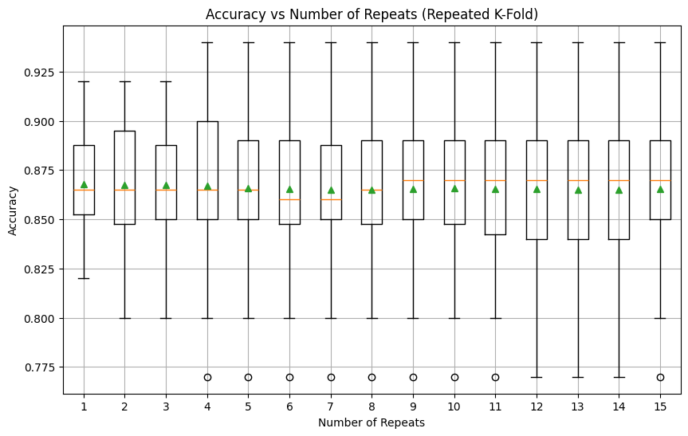

# 🔁 Repeated K-Fold Evaluation of Classifiers with Synthetic Data

This project investigates the use of **Repeated K-Fold Cross-Validation** on a synthetic classification dataset. By applying multiple machine learning models and systematically increasing the number of repeats, we analyze how performance stability improves with more validation cycles.

---

## 🎯 Project Highlights

- Generated synthetic data using `make_classification` from `sklearn.datasets`
- Compared model performance under standard K-Fold and Repeated K-Fold settings
- Evaluated multiple classifiers: Logistic Regression, Random Forest, and SVM (RBF Kernel)
- Visualized accuracy trends across repeat counts using boxplots

---

## 📊 Visualizations

Key visual output:

---

## ✅ Techniques Used

- Synthetic dataset creation (`sklearn.datasets.make_classification`)
- Cross-validation strategies: `KFold`, `RepeatedKFold`, and `cross_val_score`
- Classification Models: Logistic Regression, Random Forest, SVM (RBF)
- Feature scaling with `StandardScaler`
- Model evaluation: Accuracy, Standard Error of Mean (SEM)
- Visualization: `matplotlib.pyplot`

---

## 📁 Files

- `/code/` – Python Notebook (`.ipynb`) containing all experiments
- `/assets/` – Plots
- `README.md` – You are here

---

## 📊 Key Findings

- Single 10-fold accuracy for logistic regression: **~86.8%**
- Repeating folds up to 15 times smooths performance fluctuations significantly
- Random Forest and SVM with RBF kernel outperform linear models:
  - Random Forest Accuracy: **~92.1%**
  - SVM (RBF) Accuracy: **~96.5%**
- SVM performance suggests non-linear relationships in the data

---

## 🙋‍♂️ About Me

I'm currently pursuing a Master’s in Analytics with hands-on experience in machine learning and data visualization. My projects combine technical depth with practical interpretation using tools like **Python**, **R**, **Tableau**, and **Looker Studio**.

---

## 📬 Contact

Feel free to connect via [LinkedIn](https://www.linkedin.com/in/allen-lei-zhao/) or reach out via email: `allen.lei.zhao@gmail.com`.
